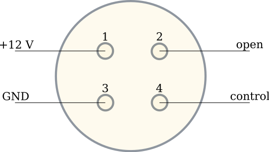

Documentation
==================

Introduction
*************

The documentation presented here describes a newly adapted Python based control system.
This system is mostly adapted upon the EUDAQ2 TLU software (https://github.com/eudaq/eudaq/tree/master/user/tlu).
And gives a rough summary of the original documentation (https://ohwr.org/project/fmc-mtlu).
In the following the control of the different hardware components as well as additional features of the control software are described.

Hardware
********************

Inter-Integrated Circuit I^2C
---------------------------------

The configuration of the different board features and hardware components goes via I^2C interface. 
This interface is widely used as a serial communication bus IPbus (https://ipbus.web.cern.ch/doc/user/html/)
and provides the protocol for the Ethernet communication driver. 
The user interface is uHAL (https://ipbus.web.cern.ch/doc/user/html/software/uhalQuickTutorial.html) a C++/Python library.
Each register has an identifying address. The addresses can be found in a yaml file. 
The script i2c.py writes and reads bits to and from each of these registers. 

I/O Expander
---------------------------------
The TLU uses four I/O expander chips PCA9539PW.
Each of these chips provide two 8-bit input output expansions and can be used in parallel for general purposes.
The 11 front panel LEDs are controlled by two expanders where the other two configure the 4 HDMI inputs or outputs of the DUT interfaces.
To configure the chip to set for e.q. the polarity of one 8-bit expansions a command byte is set to the register. 
The script ioexpander\_controller.py writes the command byte to the right expander.
To control the four expanders the script uses an identifier for the
LED expanders (io\_exp = 1) or output expanders (io\_exp = 2). 
To differentiate each of the two expanders another identifier is used (exp\_id).

Clock Chip
---------------------------------	
A Si5345 clock generator chip provides the clock. 
This clock is used internally in for e.q. the trigger generation, but can also be distributed to each of the DUT's.
The chip allows the generation of internal triggers in principle up to 160 MHz. 
The trigger rate is calculated from clock intervals this leads to a rounding error for higher trigger frequencies.
So higher trigger frequencies are shifted slightly.
The clock chip needs to be configured. To do so a configuration file containing ~380 address-data pairs is written to the chip via I^2C.
This configuration file can be generated by a software (https://www.skyworksinc.com/en/application-pages/clockbuilder-pro-software).
The default clock frequency using the default configuration file is 40 MHz. For now this frequency can not be changed. 
The script clock\_controller.py configures the chip. 
Most of the other functions are just used for bug fixing. 

Digital-Analog-Converter DAC
---------------------------------
To transform the different output and input voltages from digital signals to analog signals (or the other way around),
three AD5665R DAC's are used.
Here one DAC's is used for the photomultiplier (PMT) power outputs the other two for the threshold of the trigger inputs.
According to the data sheet the DAC's have an internal reference voltage of 2.5 V.
Although the external voltage of 1.3 V is set as default for all implemented user cases. 	
Each DAC has four output pins that can be used in parallel.
Functions to control the DAC's can be found in voltage\_controller.

Power DAC's
+++++++++++++++
The four output channels of one DAC are dedicated to the control voltage of the four different PMT power outputs.
Each output has a range of 0 V to 1 V, with the external reference voltage. 
An internal reference voltage leads to a possible output voltage of up to 2 V. 

Power Module
+++++++++++++++++
Four 4-pin LEMO connectors not only deliver a control voltage to the PMT's but also distribute power in general. 
The 4-pin LEMO has the following pin connections.
Pin 1 is used for general power 12 V, pin 2 is not connected.
The control voltage is on pin 3 and has the range [0; 1] V.
At last pin 4 is connected to ground.

Three green LEDs on the front panel indicate the correct functioning of the power module. 
The POWER LED for the 12 V supply voltage, the other two are for the 5 V voltage regulators.

Threshold DAC's
+++++++++++++++++++
To transform the analog signals of the 6 trigger inputs to digital signals two DAC's are in use.
The first two inputs are connected to one DAC the last 4 to the other one.
Each input channel is connected in reverse to the DAC input.
A mapping in software corrects these connections.
So to set the threshold of one input channel one uses the function set\_threshold with the trigger input from 1 to 6
and set the threshold to Volt. The threshold range is [-1.3; 1.3] V. 
The calculated voltage resolution is about 40 uV.
These values correspond to the external reference voltage, as the default.

HDMI connectors
---------------------------------
Four HDMI connectors are used as the interface between the TLU and the different DUT devices.
Each pin works bidirectional any two differential signal pairs can be set as output or input.
The direction of the HDMI pins is set by two I/O expanders with the following signal pins.
The first differential signal is a clock signal (CLK). 
This clock signal can be enabled/disabled and is provided either by the Clock Chip or directly from the FPGA clock.
Depending on the operating mode also different words are sent through the clock line.
The next signal is the content (CONT). This signal is used by the TLU to issue control commands.
The BUSY signal is usually set by the DUT and raises a VETO for the generation of new trigger depending on operating mode.
SPARE is only used by the AIDA mode and raises a reset signal at the start of runs and should also be driven by the TLU.
Trigger (TRIG) is set by the TLU at default.
Through the trigger line not only trigger signals are issued but also trigger words depending on the operating mode.

.. image:: img/hdmi.png
    :width: 400
    
.. table::
    :align: left

    +---------+------------------+
    |HDMI PIN | HDMI Signal Name |
    +=========+==================+
    |1        | CLK              |
    +---------+------------------+
    |2        | GND              |
    +---------+------------------+
    |3        | CLK*             |
    +---------+------------------+
    |4        | CONT             |
    +---------+------------------+
    |5        | GND              |
    +---------+------------------+
    |6        | CONT*            |
    +---------+------------------+
    |7        | BUSY             |
    +---------+------------------+
    |8        | GND              |
    +---------+------------------+
    |9        | BUSY*            |
    +---------+------------------+
    |10       | SPARE            |
    +---------+------------------+
    |11       | GND              |
    +---------+------------------+
    |12       | SPARE*           |
    +---------+------------------+
    |13       | n.c.             |
    +---------+------------------+
    |14       | POWER            |
    +---------+------------------+
    |15       | TRIG             |
    +---------+------------------+
    |16       | TRIG*            |
    +---------+------------------+
    |17       | GND              |
    +---------+------------------+
    |18       | n.c.             |
    +---------+------------------+
    |19       | n.c.             |
    +---------+------------------+

DUT Logic
---------------------------------
The DUT logic in dut\_controller.py sets the DUT operating modes.
Different DUT devices are enabled or disabled by the function set\_dut\_mask.
One important thing is to only enable DUT interfaces that are in use.
Enabling to many DUT interfaces blocks all HDMI connections XX.
The operating mode is set by the function set\_dut\_mask\_mode each DUT is controlled by two bits in an 8-bit WORD.
Bit 0 and 1 control DUT 1, bit 2 and 3 DUT 2 and so on. AIDA mode is set by setting bit to 11 and EUDET mode by setting 00.
So to set DUT 1 to AIDA mode and the rest to EUDET mode one hast to set the bit-WORD '00000011' to the function.

Trigger Logic
---------------------------------
The TLU can trigger from six different trigger inputs. 
Each input can be enabled or set to VETO new triggers.
Between each trigger input there is also the possibility to set AND or OR.
This leads to 64 possible combinations of so-called trigger words.
Each trigger word describes one specific trigger configuration. 
Where one obtains the resulting trigger configuration to write into the trigger logic register by adding up all desired valid trigger configurations.
The software uses two different variants of these words, one is the long word variant.
This is just the 64-bit trigger word. 
For the second one the long word is split into two 32-bit words (mask\_low and mask\_high).
To help with the generation of these trigger words, the software uses a specific function to translate
the trigger settings in the configuration file to these words see sec\ref{sec:config}.

The trigger signals from the different trigger inputs can be stretched and delayed accounting for 
different trigger hardware setups. 
Also, the TLU can trigger on the rising or falling edge of incoming trigger signals.

An additional feature of the trigger logic is the generation of internal triggers.
In the configuration file a specific trigger frequency can be set and the TLU will then generate triggers with said frequency.
The theoretical range of these triggers is between 0 Hz and 160 MHz.
Because the trigger frequency is calculated in reference to a clock interval, there is for now a 
rounding error for higher frequency. This shifts the actual output trigger frequency.

The number of triggers since the last trigger VETO is stored together with the 
total number of triggers per run.
From these numbers general status messages for e.q. the trigger rate are generated. 

Operating Modes
*****************
The TLU can run in different operating modes. This allows more flexibility for different DUT readouts.
Different modes can provide clock synchronizations or trigger number together with the trigger signal.
One can also set a veto signal for new signals to the TLU.

EUDET Handshake Mode
---------------------------
The TLU sets TRIGGER to high for 1 clock cycles. Afterwards the DUT asserts BUSY and sends a clock to the TLU through CLOCK. 
This clocks out the trigger number from the TLU to TRIGGER.
To set the software to the operating mode a 0b00 is set to the DUT logic.
One the other hand this mode can also be asserted with the configuration.yaml file.
The clock output needs to be disabled for this mode to work.
If the clock output is enabled and set to for e.q. chip then the trigger number is not clocked out correctly.
Where only the least significant 15 bit of the trigger word are sent out. 

AIDA Mode
-----------
At the start of a run the TLU sends out a RESET signal to the DUT.
This signal can then be used by the DUT to synchronize the timestamp of the device and the TLU. 
Then the TLU sends triggers continuously to the DUT. 
Where each trigger signal has a length of one clock cycle.
To generate a new trigger no answer of the DUT is needed.
But DUT can veto new trigger signals at any time by asserting BUSY.
To set the AIDA mode the following configurations need to be in place.
The following is a checklist for the working of the AIDA mode together with the BDAQ board.

    * AIDA Mode BDAQ Firmware.
    * Change Testbench yaml.
        * Change Trigger Mode from 3 to 2.
        * Change Trigger Handshake Wait Cycle from 5 to 1.
    * Use special clock cable configuration. 
      So enabele the clock LEMO output of the TLU 
      and connect the clock output to the BDAQ board.
    * Check Cable length to synchronize clock DUT signals.
    * Note when starting triggering, 
      the DUT scan needs to be started before the TLU scan for the 
      RESET to arrive.
    * For now also the aidamode needs to be enabled in the scan configurations.
      This can for now only be found on a special tj DAQ branch. 
      Or in the testbench yaml, depending on the setup there is to enable RESET option.

If only one BDAQ board is used in AIDA mode there is a chance for two very fast trigger to occur right one after the other.
If the distance between the triggers is smaller than the distance between the first trigger signal and the BUSY signal.
Then the tlu sends out two triggers because no handshake is awaited.
This leads to an eventnumber drift. 
Another important thing is to follow the procedure for starting an AIDA run:

    * configure TLU
    * start all DUT's, telescopes and timreference planes
    * start TLU run

AIDA Mode with Trigger Number
---------------------------------
This operating mode is an extension of the AIDA mode. 
The difference to the standard AIDA mode is, that additionally at each trigger
the trigger number is sent through RESET.

Additional features
********************

Online Monitor
----------------
The Online Monitor (https://github.com/SiLab-Bonn/online_monitor) creates real-time plots of a dataset.
This allows live observation of the trigger rate during operation.
The TLU scripts sends status information containing the trigger rate, event number, trigger number and run time to a converter script.
The converter script translates the data format and sends the data to a receiver script. 
The online monitor uses a receiver script to create the real time data plots.
The Data is sent and received using ZMQ sockets (https://zeromq.org/).
The ZMQ connection can be enabled and disabled in the configuration file.
To start the online monitor one navigates to the directory and uses for e.q. the terminal command:

.. code-block:: console

    start_online_monitor configuration.yaml

The next command reliable stops all instances of the running online monitor:

.. code-block:: console

    stop_online_monitor

Tests
------
With pytest (https://docs.pytest.org/en/7.4.x/) the AIDA TLU control program can be tested.
In the test directory different testing scripts can be found. 
The easiest way to test the whole setup it to navigate to the directory and type pytest into the terminal.
This starts a series of testing functions that start and stop different aspects of the control program.
The test setup helps to find bugs when further developing the TLU program and also to check for depreciated functions.
The command:

.. code-block:: console

    pytest

executes the complete testing infrastructure.
But also the individual log outputs can be displayed.

.. code-block:: console

    pytest -o log_cli=True

Tests can be run individually.

.. code-block:: console

    pytest software_test.py

Integration into EUDAQ2
------------------------
Due to the similarities of the python control software and the established EUDAQ TLU software
an integration into EUDAQ2 is possible.
The TLUPyProducer.py is an example skeleton of such integration.